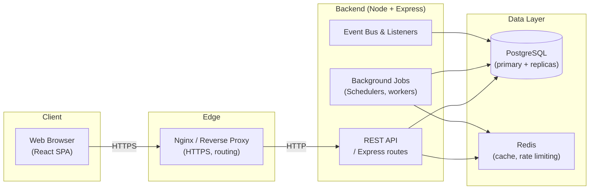
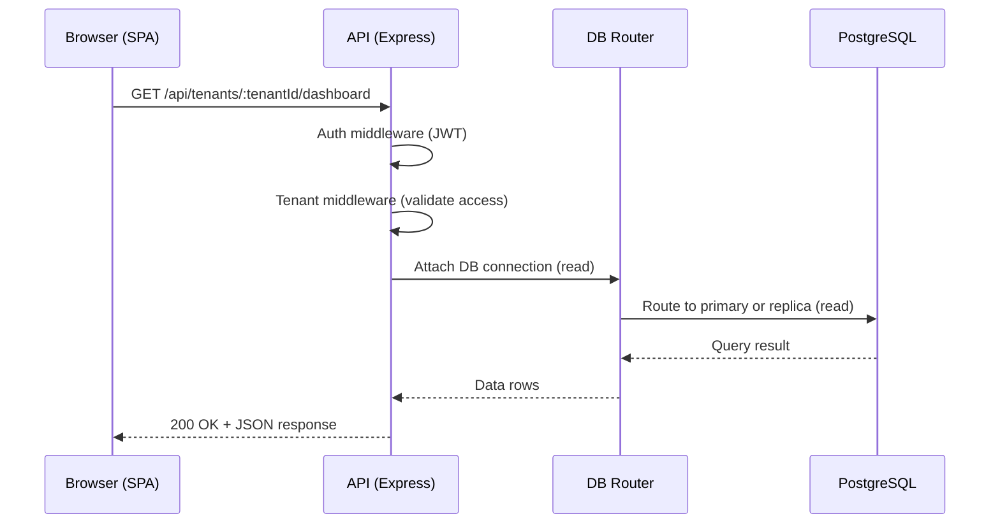
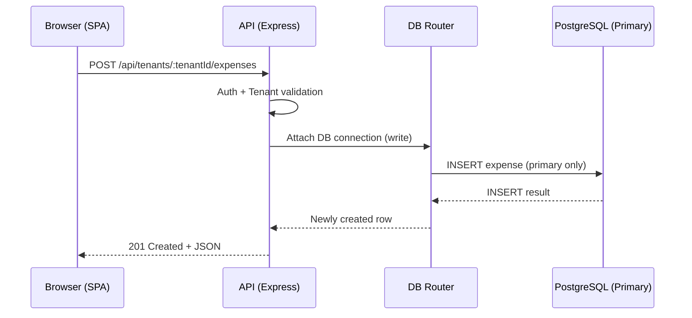
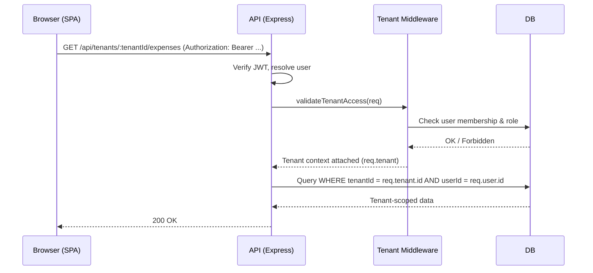

# Wealth Vault Architecture Overview

This document provides a high-level view of the Wealth Vault system: major components, data flow, multi-tenancy model, and how the pieces interact.

---

## 1. System Architecture

At a high level, Wealth Vault is a full-stack web application composed of:

- **Frontend**: React + TypeScript (Vite)
- **Backend API**: Node.js + Express
- **Database**: PostgreSQL (with optional read replicas)
- **Caching & rate limiting**: Redis (optional but recommended)
- **Background jobs & event processing**: Node-based workers scheduled via cron-like jobs and listeners
- **Reverse proxy / SSL termination**: Nginx (in production)

### 1.1 High-Level Component Diagram



- The **frontend SPA** talks to the backend via JSON HTTP APIs.
- **Nginx** terminates TLS and forwards requests to the backend in production.
- The **backend** exposes REST endpoints, orchestrates business logic, and coordinates background jobs and event listeners.
- **PostgreSQL** stores all core domain data; optional replicas can be used for read scaling via the DB routing layer.
- **Redis** is used for caching and distributed rate limiting when available.

---

## 2. Request & Data Flow

This section traces a typical user request from the browser through to the database and back.

### 2.1 Typical Web Request (Read)



1. The browser calls a tenant-scoped endpoint (e.g. dashboard, expenses, analytics).
2. The backend authenticates the request (JWT) and resolves tenant context.
3. The DB routing middleware chooses a primary or replica connection for **reads**.
4. The API formats and returns a JSON response to the SPA.

### 2.2 Typical Web Request (Write)



- All **writes** (POST/PUT/PATCH/DELETE) are routed to the **primary** database.
- The DB router also tracks a short **consistency window** so immediately following reads favor the primary to avoid replica lag issues.

### 2.3 Background Jobs & Events

- Scheduled jobs (for example, reconciliation, notifications, habit digests) run inside the backend process and interact with the same DB and Redis.
- The event bus and listeners react to domain events (e.g., budget changes, notifications, tax events) and persist derived state or send messages.

---

## 3. Multi-Tenancy Design

Multi-tenancy is implemented primarily at the **application and data model level**.

### 3.1 Tenancy Model

- **Tenants** represent organizations or workspaces.
- **Tenant members** link users to tenants with roles (e.g. owner, admin, member).
- Most domain tables include a `tenantId` column to enforce row-level isolation.

Key pieces (from the backend multi-tenancy guide):

- `tenants` table — stores tenant metadata.
- `tenant_members` table — maps users to tenants and roles.
- **Tenant middleware** — enforces that requests carry tenant context and that the authenticated user is allowed to access that tenant.
- **Tenant service** — encapsulates business logic for creating and managing tenants.

### 3.2 Tenant-Aware Request Flow



- Every protected route includes tenant middleware (`validateTenantAccess`) to ensure that:
  - The tenant exists and is active.
  - The authenticated user is a member of the tenant.
  - Optional role checks (e.g. `requireTenantRole(['owner','admin'])`) are satisfied for admin operations.
- Query patterns always include `tenantId` filters alongside user-specific conditions.

### 3.3 Tenant-Aware URL and Headers

Client requests typically provide tenant context via:

- Path parameters: `/api/tenants/:tenantId/...` (recommended)
- Optionally, query params or headers (e.g. `X-Tenant-ID`) in some cases

On the frontend, tenant-aware routes often follow patterns like:

- `/tenant/:tenantId/dashboard`
- `/tenant/:tenantId/expenses`
- `/tenant/:tenantId/categories`

---

## 4. Component Interactions

This section focuses on how major backend components interact inside a single request lifecycle.

### 4.1 Backend Middleware & Services

Key middleware chain (simplified) in `server.js`:

1. **Security middleware**
   - Helmet for security headers
   - CORS configuration
   - Body parsers with size limits
   - Input sanitizers
2. **Routing & DB middleware**
   - Response wrapper and pagination
   - DB routing (`attachDBConnection`) for read/write split
3. **Observability & security**
   - Request ID and structured logging
   - Performance and analytics middleware
   - Audit logger (captures security-relevant events)
4. **Domain routes and controllers**
   - Auth, users, expenses, goals, categories, analytics, budgets, etc.
5. **Global error handling**
   - 404 handler and centralized error handler

### 4.2 High-Level Interaction Diagram (Request Pipeline)

```mermaid
flowchart TD
  C[Client Request] --> H[Security Middleware\n(Helmet, CORS, body parsers, sanitizers)]
  H --> DBR[DB Routing Middleware\n(attachDBConnection)]
  DBR --> OBS[Observability & Security\n(logging, performance, audit)]
  OBS --> R[Route Handlers\n(auth, expenses, goals, ...)]
  R --> E[Error / 404 Handlers]
  E --> C2[HTTP Response]
```

- Middleware is applied globally to provide a consistent baseline for all routes.
- DB routing and observability layers are reusable across services and features.

### 4.3 Background Jobs & Audit Trail

- Background jobs run as part of the same backend codebase and use shared services:
  - **DB routing** for safe access to primary/replica as needed.
  - **Logging** and **audit log service** for compliance and traceability.
- Audit logs are written for important actions (auth events, permission changes, critical data operations) with sensitive fields redacted and entries chained cryptographically for tamper evidence.

---

## 5. Where to Go Next

- **Multi-tenancy details**: `backend/MULTI_TENANCY_GUIDE.md`
- **DB routing and replicas**: `DB_ROUTING_GUIDE.md`
- **Websocket & real-time features**: `backend/WEBSOCKET_GUIDE.md` (if present)
- **Security details**: `README.md` (Security Overview) and `SECURITY.md`

This document is intentionally high-level. When making architectural changes, update this file alongside the more detailed guides so that new contributors can understand the overall system shape before diving into individual modules.
