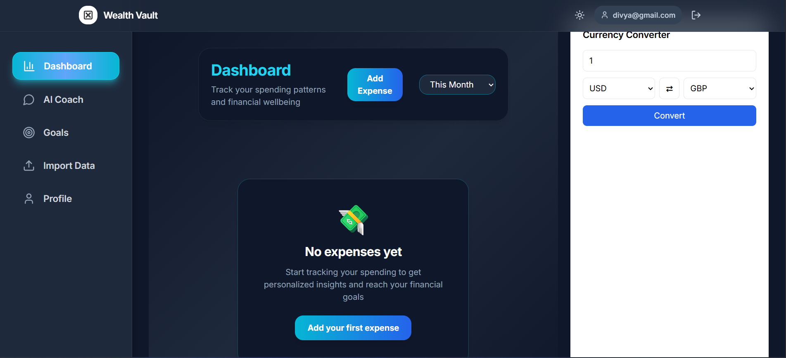

# 💰 Wealth Vault — Financial Wellness App

> **Take control of your money. Build healthier financial habits.**  
> Wealth Vault is a modern financial wellness platform that helps users understand spending behavior, set meaningful goals, and make smarter financial decisions using **AI-powered insights**.

## 📊 Badges


---

## 🌐 Website Flow

Wealth Vault guides users through a **simple three-step flow**:

1. **Landing Page**  
   Introduces Wealth Vault, highlights features, and encourages users to sign up.  
   <div align="center">
     
   </div>

2. **Authentication (Sign Up / Login)**  
   Secure user registration and login powered by **Supabase Auth**.
   <div align="center">
     
   </div>

3. **Dashboard**  
   Personalized financial insights, expense tracking, goal management, and visual analytics.  
   <div align="center">
     
   </div>

---

## ✨ What Makes Wealth Vault Different?

Wealth Vault goes beyond simple expense tracking. It focuses on **behavior-aware finance**, helping users understand _why_ they spend — not just _what_ they spend.

### 🔑 Key Features

- 🧠 **Smart Spending Analysis**  
  Categorizes expenses into **Safe**, **Impulsive**, and **Anxious** spending patterns

- 🎯 **Financial Goals Management**  
  Set, track, and visualize progress toward financial objectives

- 🤖 **AI Financial Coach**  
  Personalized insights and actionable recommendations

- 📷 **QR Code Expense Entry**  
  Log expenses instantly using QR codes and UPI

- 📊 **Visual Analytics Dashboard**  
  Interactive charts for clear spending insights

- 📁 **CSV Data Import**  
  Import historical financial data with ease

- 👤 **User Profiles**  
  Personalized financial preferences and income settings

- 🎨 **User-Friendly Interface**  
  Clean, responsive UI built for everyday use

---

## 🛠 Tech Stack

| Layer        | Technology                  |
| ------------ | --------------------------- |
| Frontend     | React 18, TypeScript, Vite  |
| Styling      | Tailwind CSS                |
| Backend & DB | Supabase (PostgreSQL)       |
| Auth         | Supabase Auth               |
| Charts       | Chart.js, React-Chartjs-2   |
| Icons        | Lucide React                |
| QR Scanning  | @zxing/browser              |

---

## ✅ Prerequisites

- Node.js **18+**
- npm
- Git

**OR** 

- Docker & Docker Compose ([see Docker setup](DOCKER_GUIDE.md))

---

## ⚡ Quick Setup

### 🚀 Automated Setup (Recommended)

Run this single command to set up everything automatically:

```bash
npm run sync
```

This will:

- Install all dependencies (root, backend, and frontend)
- Create environment configuration files
- Set up the database connection

---

### 🐳 Docker Setup

If you have Docker installed:

```bash
git clone https://github.com/csxark/Wealth-Vault.git
cd Wealth-Vault
docker-compose up
```

Access at http://localhost:3000 | [Full Docker docs →](DOCKER_GUIDE.md)


---

### 🔧 Manual Setup (Step by Step)

If you prefer manual control or the automated setup fails, follow these steps:

#### Step 1: Install Dependencies

```bash
# Install root dependencies and all sub-projects
npm install
```

**Or install individually:**

```bash
# Root dependencies
npm install

# Backend dependencies
cd .\backend\
npm install
cd ..

# Frontend dependencies
cd .\frontend\
npm install
cd ..
```

#### Step 2: Configure Environment Variables

**Automatic method:**

```bash
npm run setup
```

This creates `.env` files in both `backend/` and `frontend/` directories with template values.

**Manual method (Windows):**

1. **Backend environment:**

   - Copy `backend\env.example` to `backend\.env`
   - Edit `backend\.env` and update:
     ```
     DATABASE_URL=your_supabase_database_url
     DIRECT_URL=your_supabase_direct_url
     JWT_SECRET=your_secret_key_here
     ```

2. **Frontend environment:**
   - Copy `frontend\env.example` to `frontend\.env`
   - Edit `frontend\.env` and update:
     ```
     VITE_SUPABASE_URL=your_supabase_project_url
     VITE_SUPABASE_ANON_KEY=your_supabase_anon_key
     VITE_API_URL=http://localhost:5000/api
     ```

> **📝 Note:** Get your Supabase credentials from your [Supabase Dashboard](https://supabase.com/dashboard) → Project Settings → API

#### Step 3: Set Up Database (if using Supabase)

The application uses Supabase (PostgreSQL) for data storage. Make sure:

- You have created a Supabase project
- Your database URL and credentials are configured in `backend\.env`
- Row Level Security (RLS) policies are set up (see project documentation)

#### Step 4: Start the Application

**Start both frontend and backend together:**

```bash
npm run dev
```

**Or start individually:**

```bash
#insatll this package first
npm install concurrently --save-dev
# Backend only (runs on port 5000)
npm run dev:backend

# Frontend only (runs on port 3000)
npm run dev:frontend
```

**For separate terminals:**

```powershell
# Terminal 1 - Backend
cd backend
npm run dev

# Terminal 2 - Frontend
cd frontend
npm run dev
```

### 5️⃣ Access the Application

* **Frontend**: [http://localhost:3000](http://localhost:3000)
* **Backend API**: [http://localhost:5000/api](http://localhost:5000/api)
* **API Health Check**: [http://localhost:5000/api/health](http://localhost:5000/api/health)
* **API Documentation**: [http://localhost:5000/api-docs](http://localhost:5000/api-docs)

---

## 🔒 Security Features

* **Rate Limiting**

  * General API: 100 requests / 15 min
  * Authentication routes: 5 requests / 15 min
  * AI/Gemini routes: 20 requests / 15 min

* **Password Security**

  * Strong password enforcement
  * Real-time password strength meter
  * Requirements: ≥9 characters, uppercase, lowercase, number, special character

---

## 📚 API Documentation

Interactive API documentation is available via **Swagger UI** at `/api-docs` when the backend is running.

Includes:

* All available endpoints
* Request/response schemas
* Authentication requirements
* Try-it-out functionality

---

## API Synchronization

The frontend and backend are fully synchronized with matching data models:

- **User Management**: Authentication handled via Supabase Auth
- **Expense Tracking**: Real-time expense management with categories
- **Goal Management**: Financial goals with progress tracking
- **Category Management**: Hierarchical categories with budgets

## Database Schema

The app uses Supabase (PostgreSQL) with the following main tables:

- **profiles**: User profile information
- **transactions**: Financial transactions with spending categories
- **goals**: Financial goals and progress tracking

All tables have Row Level Security (RLS) enabled to ensure users can only access their own data.

---

## 📊 Dashboard & Key Components

### Dashboard

* Spending overview with charts
* Category breakdown: **Safe, Impulsive, Anxious**
* Budget tracking and safe spend zone

### Goals Management

* Create and track financial goals
* Visual progress indicators
* Goal completion tracking

### Profile Management

* Personal info & financial preferences
* Income and goal settings

### Expense Tracking

* QR code scanning for quick entry
* Manual expense logging
* Category classification

## Environment Variables

| Variable                 | Description                   | Required |
| ------------------------ | ----------------------------- | -------- |
| `VITE_SUPABASE_URL`      | Your Supabase project URL     | Yes      |
| `VITE_SUPABASE_ANON_KEY` | Your Supabase anon/public key | Yes      |
| `VITE_DEBUG`             | Enable debug mode             | No       |

## Development

### Available Scripts

- `npm run dev` - Start development server
- `npm run build` - Build for production
- `npm run preview` - Preview production build
- `npm run lint` - Run ESLint

---

## 🌱 Project Structure

```
frontend/
├── src/
│   ├── components/     # React components
│   ├── hooks/          # Custom React hooks
│   ├── lib/            # External library configurations
│   ├── types/          # TypeScript type definitions
│   └── utils/          # Utility functions
├── public/             # Static assets
└── package.json        # Dependencies and scripts
```

---

## 🚀 Deployment

### Vercel (Recommended)

1. Connect your GitHub repository to Vercel
2. Set environment variables in the Vercel dashboard
3. Deploy automatically on push to `main` branch

---

## Troubleshooting

### Common Issues

1. **Environment Variables Not Loading**

   - Ensure `.env` file is in the `frontend` directory
   - Restart the development server after adding variables

2. **Database Connection Errors**

   - Verify the Supabase URL and key are correct
   - Check if the database schema is properly set up
   - Ensure RLS policies are configured

3. **Authentication Issues**
   - Verify Supabase Auth is enabled
   - Check Site URL configuration in Supabase
   - Clear browser cache and local storage

### Debug Mode

Enable debug mode by setting `VITE_DEBUG=true` to see detailed console logs.

---

## 🤝 Contributing

1. Fork the repository
2. Create a feature branch
3. Make your changes
4. Add tests if applicable
5. Submit a pull request

---

## 👥 Contributors

<a href="https://github.com/csxark/Wealth-Vault/graphs/contributors">
  
</a>

---

## 📄 License

MIT License — see [LICENSE](LICENSE) for details.

---

## 🛠 Support

* Open an issue in the GitHub repository
* Review [Supabase documentation](https://supabase.com/docs) for database issues
